<a href="https://mdnishath.com">
  
</a>

  



I'm **Nishath**, author of a [WordPress.org plugin](https://wordpress.org/plugins/autocomplete-google-address/) running on 2,000+ sites and a full stack developer from Bangladesh working remotely with clients worldwide. I turn ideas into fast, production-ready software — **SEO-focused business websites**, **dashboards and APIs**, **WordPress plugins** and **Electron desktop apps** — with clean code, clear communication and on-time delivery.

 


  



  


  <a href="https://wordpress.org/plugins/autocomplete-google-address/"></a>
  <a href="https://github.com/mdnishath/wp-ultra-mcp"></a>
  <a href="https://github.com/mdnishath/headless-ecommerce-boilerplate"></a>
  <a href="https://github.com/mdnishath/pre-launch-security-audit"></a>
  <a href="https://github.com/mdnishath/wc-promo-links"></a>
  <a href="https://github.com/mdnishath/md-task-tracker"></a>

 


  <a href="https://github.com/mdnishath/nexus-v4-releases/releases"></a>
  <a href="https://github.com/mdnishath/nexus-releases/releases"></a>
  <a href="https://github.com/mdnishath/mailexus-releases/releases"></a>
  <a href="https://github.com/mdnishath/gfinder-releases/releases"></a>

 

  <a href="https://troobiolabs-web.vercel.app"></a>
  <a href="https://lazar-couverture-27.vercel.app"></a>
  <a href="https://strategimmo.vercel.app"></a>
  <a href="https://jourdain-metallerie.vercel.app"></a>
  <a href="https://mypeptideguide-ai.vercel.app"></a>
  <a href="https://campus-revenu.vercel.app"></a>
  <a href="https://www.couverturejjm.com"></a>
  <a href="https://koron-podolsky.vercel.app"></a>
  <a href="https://peptidetracker-web-sage.vercel.app"></a>
  <a href="https://les-jardins-du-val-doise.vercel.app"></a>

 



  

<picture>
  <source media="(prefers-color-scheme: dark)" srcset="assets/snake-dark.svg"/>
  
</picture>

  

 

  
  
  
  
  
  

